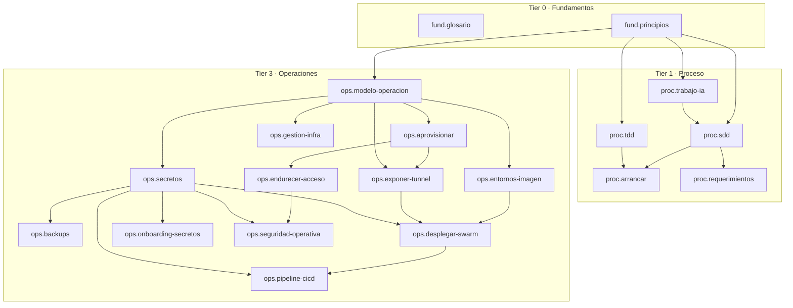

# MANIFIESTO

> ARTEFACTO DERIVADO. No lo edites a mano: lo regenera
> `node wiki/_meta/validate-graph.mjs --write` desde el frontmatter de cada doc.
> El gate (`--check`) falla si este archivo queda desincronizado.

## Protocolo para un agente en sesión fresca

1. Leé PRIMERO el **Tier 0 (Fundamentos)** completo: es el piso conceptual del que cuelga todo lo demás.
2. Descendé por tiers **bajo demanda**, no de corrido. Cada tier asume el anterior; no bajes a Operaciones si tu tarea es de Arquitectura.
3. Para una tarea concreta, cargá su **receta** (más abajo): es el cierre exacto de `reads-before` que necesitás, en orden de lectura. No leas la wiki entera.
4. Usá el **índice tema -> doc dueño** para saltar a la fuente canónica de un término sin adivinar el archivo.
5. Las flechas del DAG van de **prerequisito -> doc que lo requiere**: seguilas en el sentido de la flecha para leer en orden.

**Precedencia:** cuando la tarea coincide con una receta, el cierre de la receta reemplaza la lectura de tiers completos; el Tier 0 sigue siendo el único bloque que se lee entero.

## Tiers

| Tier | Nombre | Docs |
| ---: | --- | ---: |
| 0 | Fundamentos | 2 |
| 1 | Proceso | 5 |
| 3 | Operaciones | 12 |
| | **Total** | **19** |

## Docs por tier

### Tier 0 — Fundamentos

| id | titulo | tipo | audiencia | path |
| --- | --- | --- | --- | --- |
| `fund.glosario` | Glosario de términos | referencia | both | `fundamentos/02_referencia-glosario.md` |
| `fund.principios` | Principios del proyecto | explicacion | both | `fundamentos/01_explicacion-principios.md` |

### Tier 1 — Proceso

| id | titulo | tipo | audiencia | path |
| --- | --- | --- | --- | --- |
| `proc.arrancar` | Arrancar un proyecto nuevo | how-to | both | `proceso/04_how-to-arrancar-proyecto-nuevo.md` |
| `proc.requerimientos` | Generar los documentos de requerimientos (spec-doc-interviewer) | how-to | both | `proceso/05_how-to-generar-requerimientos.md` |
| `proc.sdd` | SDD, flujo de especificación y Gentle AI | explicacion | both | `proceso/03_explicacion-sdd.md` |
| `proc.tdd` | TDD como método | explicacion | both | `proceso/02_explicacion-tdd.md` |
| `proc.trabajo-ia` | Trabajar con un agente de IA | explicacion | both | `proceso/01_explicacion-trabajo-con-ia.md` |

### Tier 3 — Operaciones

| id | titulo | tipo | audiencia | path |
| --- | --- | --- | --- | --- |
| `ops.aprovisionar` | Aprovisionar el servidor | how-to | both | `operaciones/03_how-to-aprovisionar-servidor.md` |
| `ops.backups` | Backups | how-to | both | `operaciones/09_how-to-backups.md` |
| `ops.desplegar-swarm` | Desplegar el stack en Swarm | how-to | both | `operaciones/06_how-to-desplegar-swarm.md` |
| `ops.endurecer-acceso` | Endurecer el acceso | how-to | both | `operaciones/04_how-to-endurecer-acceso.md` |
| `ops.entornos-imagen` | Entornos e imagen Docker | referencia | both | `operaciones/02_referencia-entornos-e-imagen.md` |
| `ops.exponer-tunnel` | Exponer la app por Cloudflare Tunnel | how-to | both | `operaciones/05_how-to-exponer-cloudflare-tunnel.md` |
| `ops.gestion-infra` | Gestionar la infraestructura vía la API de Hetzner | how-to | both | `operaciones/12_how-to-gestionar-infra-via-api.md` |
| `ops.modelo-operacion` | Modelo de operación | explicacion | both | `operaciones/01_explicacion-modelo-operacion.md` |
| `ops.onboarding-secretos` | Onboarding de secretos (gestor del equipo) | how-to | both | `operaciones/13_how-to-onboarding-secretos.md` |
| `ops.pipeline-cicd` | Release por comando y CI de gates | how-to | both | `operaciones/08_how-to-pipeline-cicd.md` |
| `ops.secretos` | Secretos | referencia | both | `operaciones/07_referencia-secretos.md` |
| `ops.seguridad-operativa` | Seguridad operativa | referencia | both | `operaciones/10_referencia-seguridad-operativa.md` |

## DAG de lectura (reads-before)

Flecha = `prerequisito --> doc que lo requiere`. Leé siguiendo las flechas.

## Índice tema -> doc dueño

Cada término tiene UN solo doc dueño (provides global sin solapamiento).

| Tema | Doc dueño |
| --- | --- |
| ~/.bw_secrets (archivo local del gestor fuera del repo, chmod 600, custodiado por EL HUMANO, jamás a git ni al agente) | `ops.onboarding-secretos` |
| ~/.cf_provision.env / umask 077 | `ops.exponer-tunnel` |
| AGENTS.md / CLAUDE.md como ancla de entrada del agente | `proc.arrancar` |
| alcance por proyecto (regla del síntoma inverso; piso: dominio puro + check + slice) | `fund.principios` |
| anclas estables (wiki + convenciones + errores explícitos como memoria del agente) | `proc.trabajo-ia` |
| anti-patrón de anotar secretos en engram (sincroniza a un server compartido y commitea chunks a git: fuga al equipo y al historial) | `ops.secretos` |
| antipatrón de restringir la clave SSH a un solo comando (falsa seguridad, rompe el pipeline) | `ops.endurecer-acceso` |
| aprovisionamiento como artefacto ejecutable (provision.sh idempotente + verify.sh post-condiciones + user_data.yaml; el script es la verdad) | `ops.aprovisionar` |
| aprovisionar el Storage Box (la clave SSH nace antes que el box; puerto 23) | `ops.backups` |
| ARG GIT_SHA → ENV BUILD_SHA (lo devuelve el endpoint de health del contrato para verificar la versión servida en deploy y rollback) | `ops.entornos-imagen` |
| artefacto explícito por fase | `proc.sdd` |
| artifact store = openspec (parámetro de configuración) | `proc.arrancar` |
| artifact-store | `proc.sdd` |
| auditoría independiente con Lynis (Hardening Index >=70 + cero warnings; reporte fechado off-host) | `ops.endurecer-acceso` |
| auditoria off-host del agente (Hetzner no da audit per-recurso rico) | `ops.gestion-infra` |
| ausencia deliberada de staging (es una decisión, no un olvido) | `ops.entornos-imagen` |
| auto-reboot del parcheo desatendido (Automatic-Reboot 04:00 solo si existe /var/run/reboot-required; sin él, el kernel parcheado no se activa) | `ops.aprovisionar` |
| backup pre-migración (pg_dump -Fc validado con pg_restore --list; aborta el deploy si no valida) | `ops.backups` |
| backup sidecar del stack (servicio backup en stack.yml: pg_dump diario validado, retención 7 rotando local + Storage Box, clave SSH dedicada) | `ops.backups` |
| backups del proveedor (snapshots de disco habilitados en Fase 0, ~+20%; atajo de RTO que cubre pgdata y el raft, complemento del dump off-site) | `ops.aprovisionar` |
| barrera de verificación (probar la puerta nueva antes de cerrar la vieja) / autobloqueo / break-glass = Rescue System del proveedor (root queda bloqueada; no consola-con-password) | `ops.endurecer-acceso` |
| bootstrap del vault de secretos (import de JSON de Bitwarden una vez / bw create por API) | `ops.onboarding-secretos` |
| bootstrap local (comandos install/migrate/dev del contrato + postgres local en docker) | `ops.entornos-imagen` |
| bucle apretado de señales (tipos + tests + linters como canal de control del agente) | `proc.trabajo-ia` |
| build-on-node sin registry | `ops.modelo-operacion` |
| búsqueda por carpeta del vault (folder == app de .forja.json) para desambiguar los items de prod | `ops.onboarding-secretos` |
| BW_SESSION heredado del entorno (nunca --session por argumento: aparecería en ps) | `ops.onboarding-secretos` |
| cache de Cloudflare por URL fingerprinteada | `ops.exponer-tunnel` |
| caching escalado por niveles (entrada del dial: cache local del framework -> Redis como puerto compartido entre instancias) | `fund.principios` |
| cadena de artefactos software_requirements/ -> claude_design/ -> openspec/ | `proc.sdd` |
| capas del release: comando delgado sobre scripts deterministas; gates humanos sin scriptear | `ops.pipeline-cicd` |
| catálogo de infraestructura de producción | `ops.modelo-operacion` |
| catálogo del dial (pares disparador -> salto) | `fund.principios` |
| catch-all 404 | `ops.exponer-tunnel` |
| ceremonia proporcional al riesgo (principio) | `fund.principios` |
| chequeo por estado del spec (no por sleep temporizado) | `ops.secretos` |
| ciclo rojo-verde-refactor | `proc.tdd` |
| claude_design/ | `proc.sdd` |
| Cloudflare Tunnel / cloudflared | `ops.exponer-tunnel` |
| CNAME proxied | `ops.exponer-tunnel` |
| colisiones acotadas por slice (una feature = una carpeta = un agente; Gitflow pone la cadencia encima) | `proc.trabajo-ia` |
| comandos de verificación del stack (stack ls / stack services / secret ls) | `ops.desplegar-swarm` |
| comandos del operador en el plugin forja (deploy y rollback; scripts deterministas en el proyecto) | `ops.pipeline-cicd` |
| compartición de secretos del equipo vía gestor (materialización local, no compartir archivos; global sin carpeta vs proyecto con carpeta = app) | `ops.secretos` |
| concurrency (cancel-in-progress true para check; los deploys no se serializan en CI porque el ship es manual y humano) | `ops.pipeline-cicd` |
| config_src cloudflare | `ops.exponer-tunnel` |
| confirmar-o-crear idempotente por label | `ops.gestion-infra` |
| contrato de imagen multi-stage (targets runner / migrator / backup; el Dockerfile concreto es doctrina del stack de cada proyecto) | `ops.entornos-imagen` |
| contrato de nombre (secret.target = clave del campo en el schema de config de la app) | `ops.secretos` |
| controles CIS deliberadamente fuera del dial, con control alternativo declarado | `ops.seguridad-operativa` |
| convención de glosario (definición en una frase + puntero al doc que lo desarrolla) | `fund.glosario` |
| convención de hostnames por entorno (${PUBLIC_NAME}.<dominio> prod; <dev>-${PUBLIC_NAME}.<dominio> test, con <dev> = git config forja.devUser, fallback dev) | `ops.entornos-imagen` |
| convención de nombre ${STACK}_<clave en minúscula> | `ops.secretos` |
| convención sobre configuración (la convención vive en una herramienta, no en prosa) | `fund.principios` |
| cuatro tipos de pregunta E/A/Q/X (exploratoria, aclaratoria, de calidad, de contradicción) | `proc.requerimientos` |
| daemon.json de rotación de logs escrito antes de levantar servicios (json-file max-size/max-file) | `ops.aprovisionar` |
| DEBIAN_FRONTEND/NEEDRESTART_SUSPEND | `ops.aprovisionar` |
| delta specs / specs vigentes / capability | `proc.sdd` |
| deploy vía CI/GitHub Actions como entrada del dial (disparador: más de un operador desplegando a la vez o auditoría de release exigida) | `ops.pipeline-cicd` |
| deploy.sh <env> (5 fases; health node-side fatal + edge warn-only) | `ops.desplegar-swarm` |
| deriva del agente | `proc.sdd` |
| diff-gate firewall (describe vivo vs archivo) como plan de los pobres | `ops.gestion-infra` |
| disciplina expand/contract (migración destructiva en dos deploys; las dos versiones conviven durante el rolling) | `ops.pipeline-cicd` |
| disparador (síntoma que justifica el salto, nunca una fecha) | `fund.principios` |
| distinción APP vs PUBLIC_NAME (APP = slug de stack/imagen; PUBLIC_NAME = label DNS público; un '_' en un hostname es inválido) | `ops.entornos-imagen` |
| docker context de prod fijado en deploy.sh (${APP}-prod); test neutraliza DOCKER_CONTEXT y usa el contexto local | `ops.entornos-imagen` |
| Docker Engine | `ops.modelo-operacion` |
| Docker pineado por versión (repo APT oficial + apt-mark hold; nunca curl\|sh a latest flotante) | `ops.aprovisionar` |
| Docker secret (cifrado en el swarm, montado en /run/secrets, nunca env ni horneado en la imagen) | `ops.secretos` |
| Docker Stack como unidad | `ops.modelo-operacion` |
| docker swarm init | `ops.aprovisionar` |
| Docker Swarm orquestador de nodo único | `ops.modelo-operacion` |
| dos claves SSH para deploy (operador con passphrase vía ssh-agent vs CI sin passphrase como secret del repo) | `ops.endurecer-acceso` |
| dos entornos (dev = loop local del stack del proyecto; prod = stack en Swarm) | `ops.entornos-imagen` |
| dos tokens hcloud segregados (read default / write break-glass) | `ops.gestion-infra` |
| el dial (complejidad diferida / escalación consciente) | `fund.principios` |
| el dial hcloud scripts vs IaC para un nodo unico | `ops.gestion-infra` |
| el dominio puro es innegociable (principio) | `fund.principios` |
| el host de la DB en la cadena de conexión es el nombre de servicio (no localhost) | `ops.secretos` |
| el tag vX.Y.Z como registro del release, no como trigger; su cuerpo anotado ES el changelog generado (git log <prev>..HEAD; se lee con git tag -n99) | `ops.pipeline-cicd` |
| el test antes que la implementacion (principio) | `fund.principios` |
| el test rojo define qué es \"hecho\" | `proc.tdd` |
| elección de docker context por entorno (prod vía context/alias SSH ${APP}-prod; test con DOCKER_CONTEXT neutralizado) | `ops.desplegar-swarm` |
| enable-protection delete/rebuild como candado a nivel API | `ops.gestion-infra` |
| endurecimiento sysctl de la pila de red (CIS L1; después de Docker) | `ops.endurecer-acceso` |
| Engram | `proc.sdd` |
| entrevista de especificación por selección | `proc.requerimientos` |
| especificación ejecutable de la intención (TDD en contexto de IA) | `proc.tdd` |
| estados del túnel | `ops.exponer-tunnel` |
| estrategia de backup en dos capas | `ops.backups` |
| export de claude.ai/design como artefacto (el comando de descarga produce claude_design/; alimenta el sistema de diseño del proyecto) | `proc.arrancar` |
| external:true en compose / deploy.sh crea el secret solo si no existe (idempotencia) | `ops.secretos` |
| fail2ban backend=systemd (no hay auth.log; jail.local) | `ops.endurecer-acceso` |
| failure_action rollback | `ops.modelo-operacion` |
| Fase 0 antes del primer boot (cloud-init user_data.yaml: alta de deploy, pubkey y hardening base antes de que SSH abra) | `ops.aprovisionar` |
| fases sucesivas (especificación -> plan -> implementación) | `proc.sdd` |
| fatiga de aprobación (antipatrón) | `proc.trabajo-ia` |
| firewall de borde del proveedor (capa-1 deny-all salvo 22/tcp en v4 y v6 por separado; fuera del host, no saltable por docker -p) | `ops.aprovisionar` |
| firewall declarativo replace-rules desde archivo versionado | `ops.gestion-infra` |
| formatos de artefactos (catálogo de requisitos SRS ligero, dbdocs, Mermaid classDiagram) | `proc.sdd` |
| fronteras de fase | `proc.sdd` |
| Full SSL | `ops.modelo-operacion` |
| gate en el PR, ship por comando (/forja:deploy) — el CI verifica, no despliega | `ops.pipeline-cicd` |
| gates de fase (revisión en fronteras, no en cada edición) | `proc.trabajo-ia` |
| gates de PR del CI del proyecto (mínimo el check del contrato; los demás jobs los define cada proyecto) | `ops.pipeline-cicd` |
| generación de clave ed25519 local (la clave privada nunca llega al servidor) | `ops.endurecer-acceso` |
| Gentle AI | `proc.sdd` |
| gestión remota vía docker context sobre SSH | `ops.modelo-operacion` |
| GHCR como registry de imagen (entrada del dial: el build deja de ocurrir en la máquina que despliega) | `ops.modelo-operacion` |
| Gitflow multi-agente (main producción, develop integración, features cortas; solo main despliega vía /forja:deploy) | `proc.trabajo-ia` |
| glosario maestro (índice alfabético de términos con enlace a la fuente canónica) | `fund.glosario` |
| golden snapshot del base endurecido (atajo de RTO: rebuild desde imagen en minutos; no respalda datos) | `ops.aprovisionar` |
| gotcha de la papelera de bw (los borrados van a papelera: verificar bw list items y --trash) | `ops.onboarding-secretos` |
| gotchas de acceso al Storage Box (se prueba desde el nodo; DNS sin propagar) | `ops.backups` |
| grupo docker == root en el host (modelo de seguridad) | `ops.endurecer-acceso` |
| guarda de dump no vacío (pg_dump de cero bytes aborta la migración; un dump vacío no es respaldo) | `ops.backups` |
| guardarraíles ejecutables (principio) | `fund.principios` |
| handoff entre fases como artefacto explícito | `proc.trabajo-ia` |
| identidad de recursos por label managed-by=agent | `ops.gestion-infra` |
| identificadores de trazabilidad RF-/RNF-/RN-/INC- | `proc.sdd` |
| imagen como unidad inmutable con output standalone | `ops.modelo-operacion` |
| imagen migrator separada cuyo CMD es el comando de migraciones del stack (lee db_url desde /run/secrets/db_url) | `ops.entornos-imagen` |
| infra-verify.sh gate de post-condiciones | `ops.gestion-infra` |
| ingress hostname -> servicio | `ops.exponer-tunnel` |
| inmutabilidad del secret (docker secret rm + recreate para rotar) | `ops.secretos` |
| instalación manual de la clave pública (no ssh-copy-id; authorized_keys 600; install -d -m 700) | `ops.endurecer-acceso` |
| interfaz de operación por entorno (/forja:deploy preview\|production y /forja:rollback preview\|production; preview = swarm local) | `ops.pipeline-cicd` |
| inventario consolidado de controles de seguridad operativa (el doc como checklist de referencia) | `ops.seguridad-operativa` |
| inversión del modelo (acota quién puede ser deploy, no qué puede hacer deploy con Docker) | `ops.endurecer-acceso` |
| IP derivada de la API (nunca cacheada) | `ops.gestion-infra` |
| journald persistente y capeado (Storage=persistent + SystemMaxUse; base de fail2ban backend=systemd tras reboot) | `ops.aprovisionar` |
| la capa de dependencias cachea solo el contrato de dependencias (manifest + lockfile) | `ops.entornos-imagen` |
| las cinco lentes del panel de revisión | `proc.requerimientos` |
| las cuatro fases del interviewer (arranque, volcado, entrevista, redacción) | `proc.requerimientos` |
| las tres reglas rectoras | `fund.principios` |
| lección del pipeline por tag (provenance gate + GHCR durable: tres tandas de fixes para un flujo que una persona ejecuta en minutos) | `ops.pipeline-cicd` |
| lenguaje ubicuo | `proc.sdd` |
| limpieza de stack y secrets al mover un entorno entre contextos | `ops.desplegar-swarm` |
| liveness vs readiness probe | `ops.modelo-operacion` |
| localidad + fronteras (palancas de contexto y radio de daño) | `fund.principios` |
| mapa de lectura mínima (los cuatro docs para una sesión fresca) | `proc.arrancar` |
| mapa declarativo secrets/secrets-map.json (versionado, sin valores; entradas as env\|envfile\|file) | `ops.onboarding-secretos` |
| marcas [SUPUESTO] / [PENDIENTE] / [DECISIÓN ABIERTA] | `proc.requerimientos` |
| matriz autonomo/human-confirmed/prohibido de operaciones de infra | `ops.gestion-infra` |
| memoria de equipo (engram git sync: chunks versionados en .engram/, import al abrir sesión, sync + commit al cerrar la unidad de trabajo) | `proc.sdd` |
| migración como replicated-job declarado en stack.yml (lo lanza el propio docker stack deploy; deploy.sh la gatea con polling del estado de la task) | `ops.pipeline-cicd` |
| modelo completo de ramas (main/develop/feature/release/hotfix; bump en release/*; back-merge obligatorio main -> develop tras cada release o hotfix) | `proc.trabajo-ia` |
| modelo de defensa en profundidad del nodo (cómo se combinan los controles) | `ops.seguridad-operativa` |
| modelo distinto por fase | `proc.sdd` |
| modo automático (fases encadenadas sin pausa manual) | `proc.arrancar` |
| monitoreo base de recursos del host como precondición del dial (no es dial) | `fund.principios` |
| motor distribuido de rate limiting (entrada del dial: cuota fina con store compartido; el límite básico por endpoint no es dial) | `fund.principios` |
| nombre corto (target) vs nombre completo (<stack>_<nombre>) | `ops.secretos` |
| NOPASSWD justificado para una cuenta --disabled-password | `ops.endurecer-acceso` |
| observabilidad de disco por inodos además de bytes (df -iP; en hosts Docker los inodos se agotan antes que los bytes) | `ops.seguridad-operativa` |
| opción de escape | `proc.requerimientos` |
| openspec/ | `proc.sdd` |
| orden canónico de release (release/* -> main -> /forja:deploy -> registro -> back-merge) | `ops.pipeline-cicd` |
| orquestador delgado (nivel director que delega, distinto del nivel de trabajo) | `proc.trabajo-ia` |
| panel de revisión 3x5 (tres rondas, cinco lentes) | `proc.requerimientos` |
| paridad dev-local prod-server vía docker context | `ops.modelo-operacion` |
| Paso 0 - instalar el plugin forja y correr /forja:init (primera acción obligatoria) | `proc.arrancar` |
| patrón de nombre de stack ${APP}_<env> | `ops.entornos-imagen` |
| patrón outbox transaccional (entrada del catálogo del dial: garantía at-least-once; obligatorio si un handler con inbox produce un efecto externo) | `fund.principios` |
| plantilla del ancla (CLAUDE.md instanciado por /forja:init desde la plantilla del plugin) | `proc.arrancar` |
| política de retención de logs json-file (max-size / max-file) como guardarraíl de disponibilidad de disco | `ops.seguridad-operativa` |
| por qué el firewall solo abre SSH (el HTTP entra por túnel saliente) | `ops.endurecer-acceso` |
| precedencia de drop-ins de sshd (verificar con sshd -T) | `ops.endurecer-acceso` |
| precondición de secrets off-site | `ops.aprovisionar` |
| preflight como provenance gate (rama main, tree limpio, al día con origin, gates verdes, confirmación explícita) | `ops.pipeline-cicd` |
| pregunta de calidad con recomendación (estrella) | `proc.requerimientos` |
| pregunta de contradicción | `proc.requerimientos` |
| presupuesto de conexiones a Postgres | `ops.modelo-operacion` |
| procedimiento de rotación | `ops.secretos` |
| provisión vía API de Cloudflare | `ops.exponer-tunnel` |
| puerto interno del runner = runtime.port del contrato (.forja.json) | `ops.entornos-imagen` |
| radio de daño acotado (blast radius) | `proc.trabajo-ia` |
| raft del Swarm como ubicación de secrets | `ops.modelo-operacion` |
| read-model / CQRS (entrada del dial: proyección de lectura separada del modelo de escritura) | `fund.principios` |
| reboot tras kernel | `ops.aprovisionar` |
| red overlay backend con resolución por nombre de servicio | `ops.modelo-operacion` |
| referencia verificada de aprovisionamiento | `ops.aprovisionar` |
| regla de polling del estado de la task para jobs one-shot | `ops.pipeline-cicd` |
| regla de un solo conector (prod y el test de cada developer son túneles separados; mover un entorno entre máquinas exige bajarlo del origen primero) | `ops.desplegar-swarm` |
| regla un backup que nunca restauraste no es un backup | `ops.backups` |
| reglas de commit (Conventional Commits tipo(scope): imperativo; un commit = unidad de trabajo revisable; sin atribución de IA; commitlint es dial) | `proc.trabajo-ia` |
| reglas operativas del agente (wiki/rules/ dentro del plugin forja, impuestas por hooks del plugin) | `proc.trabajo-ia` |
| reproducibilidad de punta a punta (principio) | `fund.principios` |
| restic + timer de systemd en el host (alternativa del dial al sidecar: append-only/WORM y multi-stack por host) | `ops.backups` |
| restore | `ops.backups` |
| roadmap derivado (requisitos de software_requirements sin realizar + changes activos de openspec; nunca una lista aparte; el tablero de intake es dial) | `proc.sdd` |
| robusto no es máximo (principio) | `fund.principios` |
| rollback en dos planos (software: service rollback barato y automático-ofrecible; datos: pg_restore destructivo, human-confirmed) | `ops.pipeline-cicd` |
| rollback multi-versión (tags post-health, descripción por commit, regreso con latest) | `ops.pipeline-cicd` |
| Row-Level Security de PostgreSQL (entrada del dial: aislar filas por tenant cuando aparece multi-tenancy real) | `fund.principios` |
| runbook de onboarding de secretos por developer (instalar bw, apuntar al server, desbloquear BW_SESSION, materializar) | `ops.onboarding-secretos` |
| runbook de recuperación ante desastre | `ops.aprovisionar` |
| salvaguardas del deploy (working tree sucio, confirmación explícita; secrets: preflight blando + aserción dura REQUIRED_SECRETS contra el swarm) | `ops.pipeline-cicd` |
| scripts/materialize-secrets.sh (materializa el mapa desde el gestor; --prod agrega los items del proyecto) | `ops.onboarding-secretos` |
| sdd-init | `proc.sdd` |
| secrets/<env>.env (fuente local gitignored) | `ops.secretos` |
| secuencia de aprovisionamiento | `ops.aprovisionar` |
| secuencia de arranque de proyecto nuevo (cinco pasos) | `proc.arrancar` |
| secuencia describe -> diff -> confirmar -> apply -> verify del wrapper | `ops.gestion-infra` |
| separación de planos: fail2ban solo el 22; app-layer = Cloudflare | `ops.seguridad-operativa` |
| sin HEALTHCHECK a nivel de imagen (la readiness vive en stack.yml y gobierna el rollback) | `ops.entornos-imagen` |
| sin puertos entrantes y egress por 7844 | `ops.modelo-operacion` |
| skills curadas transferibles por convención | `proc.trabajo-ia` |
| snapshot pre-cambio como precondicion | `ops.gestion-infra` |
| software_requirements/ | `proc.sdd` |
| spec-doc-interviewer | `proc.sdd` |
| Spec-Driven Development (SDD) | `proc.sdd` |
| SSE como feature deliberada (entrada del dial: endpoint de streaming; push unidireccional servidor->cliente) | `fund.principios` |
| sshd_config.d/00-hardening.conf (00- gana precedencia sobre 50-cloud-init.conf; PermitRootLogin no, PasswordAuthentication no, PubkeyAuthentication yes; sshd -T efectivo; reload ssh) | `ops.endurecer-acceso` |
| stack deploy no remueve servicios eliminados del yml (retirar un servicio = quitarlo del yml + docker service rm manual) | `ops.desplegar-swarm` |
| staging riel (ENV=test precableado en deploy.sh, off por defecto; el pipeline vive en ops.pipeline-cicd) | `ops.entornos-imagen` |
| start-first | `ops.modelo-operacion` |
| Strict TDD mode (parámetro de configuración de Gentle AI) | `proc.arrancar` |
| sub-agente (unidad que posee una feature de punta a punta) | `proc.trabajo-ia` |
| sudoers.d NOPASSWD / visudo -cf | `ops.endurecer-acceso` |
| swapfile modesto (2G + vm.swappiness=10 como red de seguridad contra el OOM killer) | `ops.aprovisionar` |
| Test-Driven Development (TDD) (definición conceptual) | `proc.tdd` |
| TLS mode Full / etiqueta única con guion | `ops.exponer-tunnel` |
| token de servicios de hooks en ~/.zshenv y no ~/.zshrc (los hooks corren en shells no interactivos) | `ops.onboarding-secretos` |
| token scoped | `ops.exponer-tunnel` |
| token-file para cloudflared | `ops.modelo-operacion` |
| topología de tres servicios | `ops.modelo-operacion` |
| tradeoff del raft cifrado sin --autolock (la mitigación real es el control de acceso al host y al proveedor, no la unlock-key) | `ops.modelo-operacion` |
| transición de estado del túnel inactive -> healthy al conectar el conector | `ops.desplegar-swarm` |
| tres imágenes por --target (runner → ${APP}:latest; migrator → ${APP}:migrate; backup → ${APP}:backup) | `ops.entornos-imagen` |
| ufw (default deny incoming, allow outgoing, allow 22/tcp) | `ops.endurecer-acceso` |
| un túnel por entorno | `ops.exponer-tunnel` |
| un túnel un conector | `ops.modelo-operacion` |
| unattended-upgrades | `ops.aprovisionar` |
| usuario deploy disabled-password | `ops.aprovisionar` |
| usuario sin privilegios en el runner (la app nunca corre como root) | `ops.entornos-imagen` |
| verificación funcional del ban de fail2ban (banip de prueba debe aparecer en nft list ruleset; banaction nftables-multiport) | `ops.endurecer-acceso` |
| volcado libre | `proc.requerimientos` |
| VPS de un solo nodo | `ops.modelo-operacion` |
| WebSockets (salto mayor del dial: canal bidireccional persistente; suele exigir servidor aparte) | `fund.principios` |
| wrapper hcloud-agent.sh como choke-point | `ops.gestion-infra` |
| ZONE_ID / ACCOUNT_ID derivados de la API | `ops.exponer-tunnel` |

## Recetas por tarea

Cada receta es el cierre de `reads-before` de su doc de entrada, en orden de lectura (prerequisitos primero).

### `nueva-feature`

Entrada: `proc.sdd`, `proc.tdd` — 4 docs.

1. `fund.principios` — Principios del proyecto _(tier 0)_
2. `proc.tdd` — TDD como método _(tier 1)_
3. `proc.trabajo-ia` — Trabajar con un agente de IA _(tier 1)_
4. `proc.sdd` — SDD, flujo de especificación y Gentle AI _(tier 1)_

### `desplegar`

Entrada: `ops.pipeline-cicd` — 8 docs.

1. `fund.principios` — Principios del proyecto _(tier 0)_
2. `ops.modelo-operacion` — Modelo de operación _(tier 3)_
3. `ops.aprovisionar` — Aprovisionar el servidor _(tier 3)_
4. `ops.entornos-imagen` — Entornos e imagen Docker _(tier 3)_
5. `ops.secretos` — Secretos _(tier 3)_
6. `ops.exponer-tunnel` — Exponer la app por Cloudflare Tunnel _(tier 3)_
7. `ops.desplegar-swarm` — Desplegar el stack en Swarm _(tier 3)_
8. `ops.pipeline-cicd` — Release por comando y CI de gates _(tier 3)_

### `rollback`

Entrada: `ops.pipeline-cicd` — 8 docs.

1. `fund.principios` — Principios del proyecto _(tier 0)_
2. `ops.modelo-operacion` — Modelo de operación _(tier 3)_
3. `ops.aprovisionar` — Aprovisionar el servidor _(tier 3)_
4. `ops.entornos-imagen` — Entornos e imagen Docker _(tier 3)_
5. `ops.secretos` — Secretos _(tier 3)_
6. `ops.exponer-tunnel` — Exponer la app por Cloudflare Tunnel _(tier 3)_
7. `ops.desplegar-swarm` — Desplegar el stack en Swarm _(tier 3)_
8. `ops.pipeline-cicd` — Release por comando y CI de gates _(tier 3)_

### `arrancar-proyecto`

Entrada: `proc.arrancar`, `proc.requerimientos` — 6 docs.

1. `fund.principios` — Principios del proyecto _(tier 0)_
2. `proc.tdd` — TDD como método _(tier 1)_
3. `proc.trabajo-ia` — Trabajar con un agente de IA _(tier 1)_
4. `proc.sdd` — SDD, flujo de especificación y Gentle AI _(tier 1)_
5. `proc.arrancar` — Arrancar un proyecto nuevo _(tier 1)_
6. `proc.requerimientos` — Generar los documentos de requerimientos (spec-doc-interviewer) _(tier 1)_

### `onboarding-secretos`

Entrada: `ops.onboarding-secretos` — 4 docs.

1. `fund.principios` — Principios del proyecto _(tier 0)_
2. `ops.modelo-operacion` — Modelo de operación _(tier 3)_
3. `ops.secretos` — Secretos _(tier 3)_
4. `ops.onboarding-secretos` — Onboarding de secretos (gestor del equipo) _(tier 3)_

### `operar-servidor`

Entrada: `ops.seguridad-operativa`, `ops.backups`, `ops.gestion-infra` — 8 docs.

1. `fund.principios` — Principios del proyecto _(tier 0)_
2. `ops.modelo-operacion` — Modelo de operación _(tier 3)_
3. `ops.aprovisionar` — Aprovisionar el servidor _(tier 3)_
4. `ops.gestion-infra` — Gestionar la infraestructura vía la API de Hetzner _(tier 3)_
5. `ops.secretos` — Secretos _(tier 3)_
6. `ops.backups` — Backups _(tier 3)_
7. `ops.endurecer-acceso` — Endurecer el acceso _(tier 3)_
8. `ops.seguridad-operativa` — Seguridad operativa _(tier 3)_
